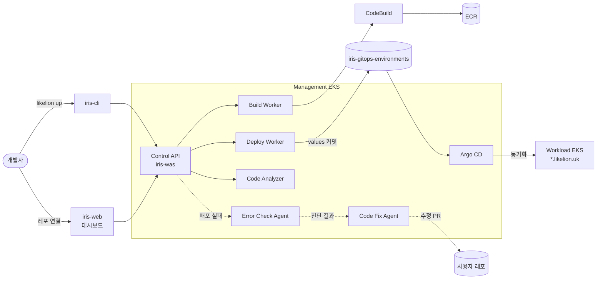

<div align="center">

# 🦁 LikeLion by Team Iris

**코드만 올리면 빌드·배포·장애 진단·수정 PR까지 — AI가 붙은 배포 자동화 플랫폼**

2026 SoftBank Hackathon 1차 예선 · Team Iris

[🎬 데모 영상]() · [🌐 라이브 서비스]() · [📑 발표 자료]()

</div>

---

## 💡 왜 만들었나

배포는 Dockerfile·인프라·파이프라인을 알아야 하고, 실패하면 로그를 뒤져 원인을 찾아야 한다.
LikeLion은 **GitHub 레포 연결 또는 `likelion up` 한 번**으로 배포하고, 실패하면 **AI가 원인을 진단해 수정 PR까지 올린다.**

## ✨ 핵심 기능

- **원클릭 배포** — 대시보드에서 레포 연결 또는 CLI `likelion up`. 빌드·배포·도메인(`*.likelion.uk`)까지 자동
- **AI 코드 분석** — 소스를 실행하지 않고 Node/Vite/Express/Dockerfile/Compose 구성을 읽어 배포 방법을 추론
- **AI 오류 진단** — 실패 로그와 소스 스냅샷으로 원인 후보·근거·해결안 제시
- **AI 자동 수정** — 진단 결과로 수정안을 만들어 hotfix 브랜치와 PR 생성
- **GitOps 배포·롤백** — image digest 고정, Argo CD 동기화, 직전 정상 release로 롤백
- **실시간 관측** — 배포 단계별 상태, 런타임 로그 스트리밍(SSE), 메트릭

## 🏗 아키텍처



인프라(VPC·EKS 2개·Argo CD·관측 스택)는 모두 [iris-infra](https://github.com/2026-softbank-1/iris-infra)의 Terraform·Helm 코드로 관리한다.

## 📦 레포지토리

| 영역 | 레포 | 설명 | 스택 |
|---|---|---|---|
| 플랫폼 | [iris-was](https://github.com/2026-softbank-1/iris-was) | Control API · Build/Deploy Worker | FastAPI, PostgreSQL |
| | [iris-web](https://github.com/2026-softbank-1/iris-web) | 대시보드 | React, TypeScript, Vite |
| | [iris-cli](https://github.com/2026-softbank-1/iris-cli) | `likelion` CLI (login · link · up · logs) | TypeScript, Node.js |
| AI 에이전트 | [iris-code-analyzer-agent](https://github.com/2026-softbank-1/iris-code-analyzer-agent) | 레포 정적 분석 · 배포 구성 추론 | Python, OpenCode |
| | [iris-error-check-agent](https://github.com/2026-softbank-1/iris-error-check-agent) | 배포 로그 기반 오류 진단 | Python, OpenCode, RDF/SHACL |
| | [iris-code-fix-agent](https://github.com/2026-softbank-1/iris-code-fix-agent) | 진단 결과 기반 수정안 · PR 생성 | Python |
| 인프라 | [iris-infra](https://github.com/2026-softbank-1/iris-infra) | AWS · EKS · Helm · Argo CD · 관측 스택 | Terraform, Helm |
| | [iris-gitops-environments](https://github.com/2026-softbank-1/iris-gitops-environments) | 사용자 서비스·플랫폼 배포 상태(values) | Argo CD |

## 🚀 Quick Start

```bash
npm install -g https://github.com/2026-softbank-1/iris-cli/releases/download/v0.2.0/likelion-0.2.0.tgz
likelion login      # GitHub 로그인
likelion link       # 배포할 폴더를 프로젝트·서비스에 연결
likelion up         # 업로드 → 빌드 → 배포
```

## 🛠 Tech Stack


## 👥 Team Iris

| | 이름 | 역할 | 담당 |
|---|---|---|---|
|  | [@kylo-dev](https://github.com/kylo-dev) | Infra · DevOps | iris-infra, iris-gitops-environments |
|  | [@timbergrizz](https://github.com/timbergrizz) | Infra | iris-infra |
|  | [@Saccharine1211](https://github.com/Saccharine1211) | Backend · Frontend | iris-was, iris-web, iris-cli |
|  | [@monitor5](https://github.com/monitor5) | AI Agent · Backend | iris-code-analyzer-agent, iris-code-fix-agent, iris-was |
|  | [@kimhwan1103](https://github.com/kimhwan1103) | AI Agent | iris-error-check-agent |
